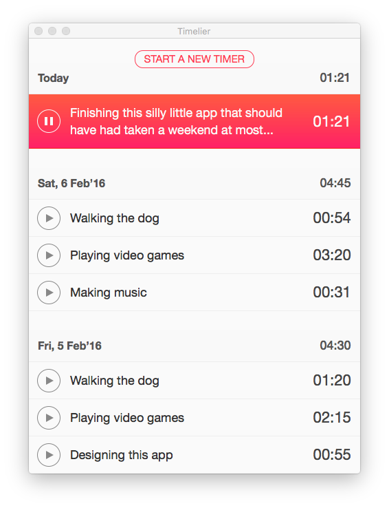

# Timelier – A Time Tracker

Built with love, patience, [Backbone.js](http://backbonejs.org), [Backbone.localStorage](https://github.com/jeromegn/Backbone.localStorage), and [MacGap](https://github.com/MacGapProject/MacGap2/).

## License 

Copyright 2016 Anton Muraviev <anton@goodmoaning.me>

Licensed under the Apache License, Version 2.0 (the "License"); you may not use this project except in compliance with the License. You may obtain a copy of the License at http://www.apache.org/licenses/LICENSE-2.0

Unless required by applicable law or agreed to in writing, software distributed under the License is distributed on an "AS IS" BASIS, WITHOUT WARRANTIES OR CONDITIONS OF ANY KIND, either express or implied. See the License for the specific language governing permissions and limitations under the License.